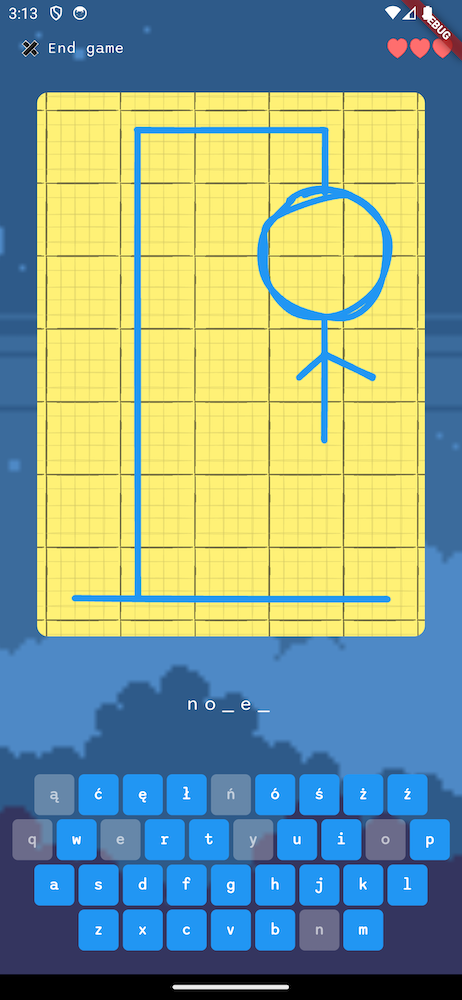

# mrhangman

Simple hangman game

- 3 screens
- custom services
- custom data models
- Highscores service registered in DI container
- configurable lives count
- custom keyboard implementation
- horizontal and vertical views
- custom header instead of AppBar in game view
- highscores support (persistent storage demo)

## Screenshots

